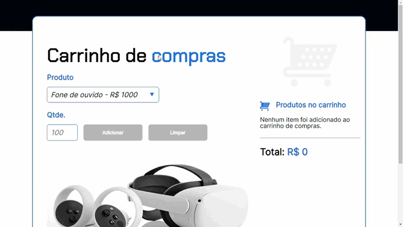

# Shopping Cart

## About

This application has the following functionality: simulate and explain a shopping cart that are made by stores that promote items in a certain quantity.

This way, with this project you will be able to add items to the cart, only remove all items from the cart and not individually, and the amount of the price of the items paid will be shown, and if any items were added.

This project has some validations, so the user must enter the quantity, otherwise they will not have access to the add or clear button, as nothing has been added yet - in addition, they will not be able to add numbers smaller than 1 (0 or negative) - just a quantity or more. If you want to add more items to the list, there is a mock array that does this, just go to js, which will find the file.

## Layout

Here is the link to access the project - deploy:
[Shopping Cart](https://shopping-cart-eight-beta.vercel.app/).



## How to execute the project?

```bash
# Terminal

git clone https://gitlab.com/mateusdev3400/shopping-cart
git clone https://github.com/mateusdev3400/shopping-cart

cd shopping-cart/

index.html # Live Server

```

## Technologies

The following tools were used in the construction of the project:

### Frontend

- HTML5
- CSS3
- JavaScript

## Contributors

<table>
    <thead>
        <tr>
            <td>
                
            </td>
        </tr>
    </thead>
    <tbody>
        <tr>
            <th>Mateus Maciel</th>
        </tr>
    </tbody>
</table>

### How to contribute

- Fork the project.
- Create a new branch with your changes: ```bash git checkout -b my-feature```
- Save the changes and create a confirmation message telling you what you did: ```git commit -m "modified file"```
- Submit your changes: ```git push origin my-feature```

## Licença

This project is licensed under the Alura Cursos license.